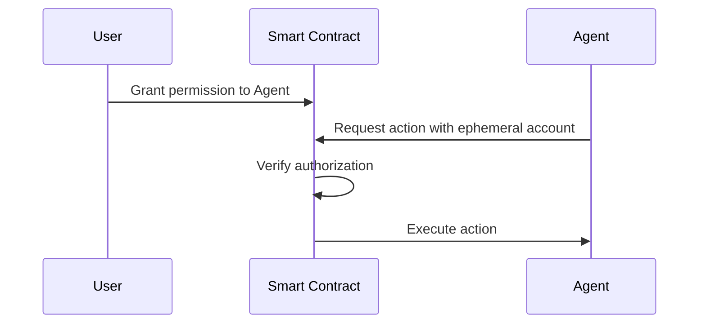

## Start with ERC-8004

ERC-8004 provides a standard interface for onchain agent authorization, enabling secure delegation of permissions from users to autonomous agents. This allows agents to act on behalf of users while maintaining security and control.

## What is ERC-8004?

ERC-8004 (Ephemeral Account) is an Ethereum standard that defines:

- **Delegated Authority**: Users can grant specific permissions to agents
- **Time-Bound Access**: Permissions can expire after a set duration
- **Revocable Access**: Users can revoke agent permissions at any time
- **Granular Control**: Define exactly what actions an agent can perform

## Core Concepts

### 1. Ephemeral Accounts

Ephemeral accounts are temporary accounts that agents use to interact with smart contracts on behalf of users:

- Created by the user for the agent
- Have specific permissions and limits
- Can be revoked or expire automatically
- Minimize risk compared to full key access

### 2. Authorization Flow



### 3. Permission Scopes

Define what actions an agent can perform:

- **Function-level**: Only call specific functions
- **Value-limited**: Maximum transaction amounts
- **Time-limited**: Expiration timestamps
- **Usage-limited**: Maximum number of calls

## Implementation Example

Coming soon! The ERC-8004 standard is actively being developed. Check the resources below for the latest updates.

```typescript
// Placeholder for ERC-8004 implementation
// This section will be updated as the standard matures

interface IEphemeralAccount {
  // Grant permission to an agent
  grantPermission(
    agent: string,
    scope: PermissionScope,
    expiry: number
  ): Promise<void>;
  
  // Revoke agent permission
  revokePermission(agent: string): Promise<void>;
  
  // Check if agent has permission
  hasPermission(agent: string): Promise<boolean>;
}
```

## Use Cases

### 1. Trading Agents

Allow agents to execute trades within defined limits:

- Maximum trade size
- Allowed trading pairs
- Stop-loss limits
- Time windows for trading

### 2. Portfolio Management

Delegate portfolio rebalancing to agents:

- Rebalancing thresholds
- Approved assets
- Maximum allocations
- Emergency stop conditions

### 3. DeFi Automation

Enable agents to manage DeFi positions:

- Yield farming strategies
- Loan management
- Liquidation protection
- Fee optimization

## Security Considerations

When building agents with ERC-8004:

1. **Minimize Permissions**: Grant only necessary permissions
2. **Set Expiration Times**: Use time-limited authorizations
3. **Monitor Activity**: Track agent actions and performance
4. **Emergency Revocation**: Implement quick permission revocation
5. **Test Thoroughly**: Validate agent behavior before production use

## Current Status

<Note>
ERC-8004 is currently in development. This guide will be updated as the standard progresses through the EIP process. For the latest information, visit the ERC-8004 proposal.
</Note>

## Next Steps

<CardGroup cols={2}>
  <Card title="Build an Agent" icon="robot" href="/cookbook/agents/build-an-agent">
    Create autonomous agents on SKALE
  </Card>
  <Card title="Start with x402" icon="dollar-sign" href="/get-started/agentic-builders/start-with-x402">
    Build payment-enabled agents using x402
  </Card>
</CardGroup>

## Resources

- [ERC-8004 Proposal](https://github.com/ethereum/EIPs) (Coming Soon)
- [Agent Security Best Practices](/developers/security)
- [SKALE Agent Documentation](/cookbook/agents/build-an-agent)

---

<Info>
This page will be updated as ERC-8004 development progresses. Check back for implementation examples and production-ready code.
</Info>
