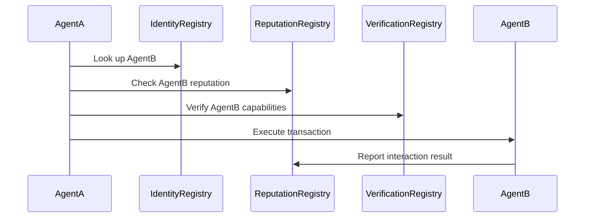

ERC-8004 creates a **trust layer for autonomous AI agents** on Ethereum. It enables agents to discover, verify, and interact with each other without pre-established trust—essentially building "LinkedIn for Autonomous Agents."

## What is ERC-8004?

ERC-8004 is a standard that provides three lightweight on-chain registries:

1. **Identity Registry** – Agent identification and ownership
2. **Reputation Registry** – Track agent credibility over time
3. **Verification Registry** – Validate agent capabilities and claims

This enables **trustless Agent-to-Agent (A2A)** interactions—agents can discover and transact with each other across organizational boundaries without needing prior relationships.

## Quick Start

Build your first ERC-8004 agent in 5 minutes.

### Prerequisites

```bash
npm install ethers@6
```

### 1. Deploy or Find Registries

ERC-8004 requires three registries. On SKALE, you can:

- **Option A**: Deploy your own registries (full control)
- **Option B**: Use existing community registries (faster, shared reputation)

```typescript
// Deploy new registries
import { ethers } from 'ethers';

const provider = new ethers.JsonRpcProvider('YOUR_SKALE_RPC_URL');
const wallet = new ethers.Wallet('YOUR_PRIVATE_KEY', provider);

// Deploy Identity Registry
const IdentityFactory = await ethers.getContractFactory('ERC8004IdentityRegistry');
const identityRegistry = await IdentityFactory.deploy();
await identityRegistry.waitForDeployment();
const identityAddress = await identityRegistry.getAddress();

// Deploy Reputation Registry
const ReputationFactory = await ethers.getContractFactory('ERC8004ReputationRegistry');
const reputationRegistry = await ReputationFactory.deploy();
await reputationRegistry.waitForDeployment();
const reputationAddress = await reputationRegistry.getAddress();

// Deploy Verification Registry
const VerificationFactory = await ethers.getContractFactory('ERC8004VerificationRegistry');
const verificationRegistry = await VerificationFactory.deploy();
await verificationRegistry.waitForDeployment();
const verificationAddress = await verificationRegistry.getAddress();

console.log({ identityAddress, reputationAddress, verificationAddress });
```

### 2. Register Your Agent

```typescript
const agentId = ethers.keccak256(ethers.toUtf8Bytes('my-first-agent'));

const metadata = {
  name: 'Price Oracle Agent',
  description: 'Fetches and verifies crypto prices from multiple sources',
  capabilities: ['fetch-price', 'verify-price'],
  version: '1.0.0',
  owner: wallet.address
};

// Upload metadata to IPFS (use nft.storage, pinata, etc.)
// const metadataUri = 'ipfs://Qm...';

const tx = await identityRegistry.registerAgent(agentId, metadataUri);
await tx.wait();

console.log(`Agent registered: ${agentId}`);
```

### 3. Discover Other Agents

```typescript
// Find agents by capability
const agentIds = await identityRegistry.getAgentsByCapability('execute-trade');

for (const id of agentIds) {
  const metadata = await identityRegistry.getAgentMetadata(id);
  const reputation = await reputationRegistry.getReputation(id);

  console.log({
    id,
    name: metadata.name,
    score: reputation.score,
    successRate: `${reputation.successfulInteractions}/${reputation.totalInteractions}`
  });
}
```

### 4. Interact & Build Reputation

```typescript
async function interactWithAgent(targetAgentId: string, action: () => Promise<void>) {
  try {
    // Execute the interaction
    await action();

    // Record success
    await reputationRegistry.recordInteraction(targetAgentId, true, 100);
    console.log('Interaction successful');

  } catch (error) {
    // Record failure
    await reputationRegistry.recordInteraction(targetAgentId, false, 50);
    console.error('Interaction failed:', error);
  }
}

// Example: Trade with another agent
await interactWithAgent(targetAgentId, async () => {
  // Your agent logic here
  console.log('Executing trade...');
});
```

## Core Concepts

### 1. Agent Identity

Each agent registers an on-chain identity:

```typescript
interface AgentIdentity {
  id: bytes32;           // Unique agent identifier
  owner: address;        // Agent owner/creator
  metadata: string;      // URI to agent details (name, description, capabilities)
  registeredAt: uint256; // Registration timestamp
}
```

### 2. Reputation Tracking

Reputation accumulates through on-chain interactions:

```typescript
interface Reputation {
  agentId: bytes32;
  score: uint256;        // Cumulative reputation score
  totalInteractions: uint256;
  successfulInteractions: uint256;
  lastUpdated: uint256;
}
```

### 3. Verification System

Third parties can verify agent capabilities:

```typescript
interface Verification {
  agentId: bytes32;
  verifier: address;     // Who verified
  claim: string;         // What was verified (e.g., "can execute trades")
  validUntil: uint256;   // Expiration
}
```

### A2A Interaction Flow



## API Reference

### Identity Registry

| Function | Description |
|----------|-------------|
| `registerAgent(agentId, metadataUri)` | Register a new agent |
| `getAgentMetadata(agentId)` | Fetch agent metadata |
| `getAgentsByOwner(address)` | List all agents by owner |
| `updateMetadata(agentId, newUri)` | Update agent metadata |

### Reputation Registry

| Function | Description |
|----------|-------------|
| `recordInteraction(agentId, success, weight)` | Record an interaction result |
| `getReputation(agentId)` | Get agent reputation data |
| `getTopAgents(limit)` | Get highest-ranked agents |

### Verification Registry

| Function | Description |
|----------|-------------|
| `verifyCapability(agentId, claim, expiry)` | Verify a capability |
| `getVerifications(agentId)` | Get all verifications for agent |
| `isVerified(agentId, claim)` | Check if specific claim is verified |

## Use Cases

### 1. Multi-Agent Workflows

Orchestrate complex tasks across multiple autonomous agents:

- **Research agents** gather data
- **Analysis agents** process findings
- **Execution agents** perform transactions

Each agent discovers and evaluates others through the reputation layer.

### 2. Agent Marketplaces

Build open markets where agents compete:

- Agents with higher reputation command higher fees
- Verification badges signal specialized capabilities
- Performance tracked on-chain, transparent to all

### 3. Cross-Organization Collaboration

Enable agents from different organizations to collaborate:

- No pre-existing trust relationships required
- Reputation and verification provide confidence
- Identity registry ensures accountability

## Security Considerations

1. **Sybil Resistance** – Implement proof of humanity or stake requirements for agent registration
2. **Reputation Gaming** – Design scoring to prevent manipulation (e.g., decay scores over time)
3. **Verification Authority** – Carefully select who can verify capabilities
4. **Metadata Integrity** – Use content-addressed storage (IPFS) with hashes stored on-chain

## Current Status

<Note>
ERC-8004 is an active proposal in the Ethereum ecosystem. The standard is being refined through community discussion. Implementation details may evolve.
</Note>

## Next Steps

<CardGroup cols={2}>
  <Card title="Build an Agent" icon="robot" href="/cookbook/agents/build-an-agent">
    Create autonomous agents on SKALE
  </Card>
  <Card title="Start with x402" icon="dollar-sign" href="/get-started/agentic-builders/start-with-x402">
    Build payment-enabled agents using x402
  </Card>
</CardGroup>

## Resources

- [ERC-8004 Proposal](https://eips.ethereum.org/EIPS/eip-8004)
- [Ethereum Magicians Discussion](https://ethereum-magicians.org/t/erc-8004-trustless-agents/)
- [Agent Security Best Practices](/developers/security)
- [SKALE Agent Documentation](/cookbook/agents/build-an-agent)
