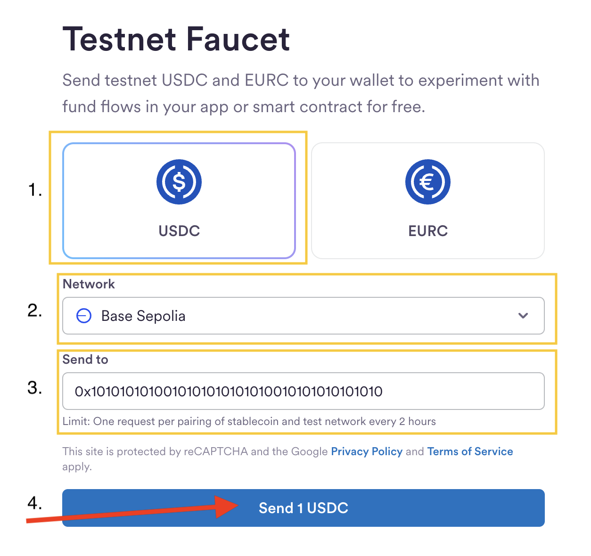
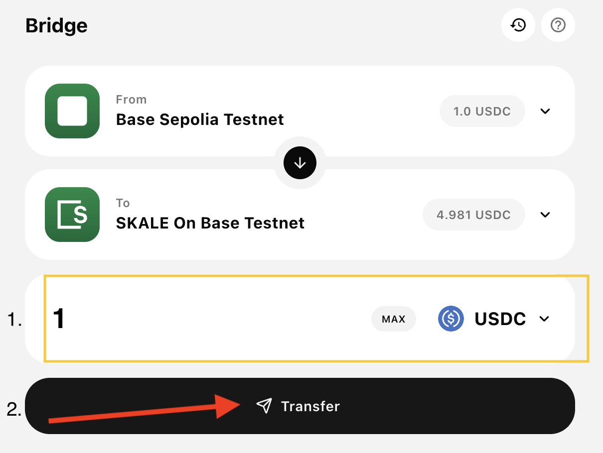

This section walks you through the steps to obtain testnet tokens and bridge them into a specific SKALE Chain for testing and development.

### SKALE Base Sepolia Testnet

<Tabs>
    <Tab title="USDC">
    1. Go to [Circle Faucet](https://faucet.circle.com/)         
    2. Select the following options:
        - Token: **USDC**
        - Network: **Base Sepolia**
        - Send to: **0x_your_wallet_address**

    

    3. Head to the SKALE Base Portal -- [bridge section](https://base-sepolia.skalenodes.com/bridge?from=mainnet&to=jubilant-horrible-ancha&token=usdc&type=erc20)
    4. [OPTIONAL] Check [here](https://docs.base.org/base-chain/tools/network-faucets) to get some gas to complete the bridge operation.
    5. Enter the amount and select bridge

     
    </Tab>
</Tabs>

### Next Steps

<CardGroup cols={2}>
  <Card title="SKALE On Base" icon="link" href="./skale-on-base">
    Check the SKALE on Base for more chain details
  </Card>

  <Card title="SKALE On Etehreum" icon="link" href="./skale-on-ethereum">
    Check the SKALE on Ethereum for more chain details
  </Card>
</CardGroup>