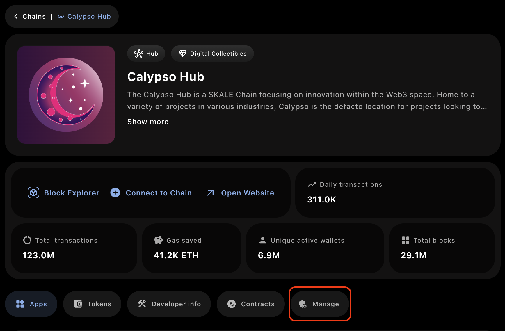

import { Aside } from "@astrojs/starlight/components";

Having a dedicated SKALE Chain is similiar to having dedicated resources on a cloud provider.
Similiar to your cloud provider, you have expenses owed in return for the compute provided.
SKALE has a unique pricing structured that is governed by the [SKALE DAO](https://snapshot.box/#/s:skale.eth).

## SKALE Chain Types

The modular design of SKALE Supernodes allows for a single supernode to support many SKALE Chains of varying sizes.
The SKALE Network currently has one official size accepted by the DAO and a second size activley in discussion.

| Chain Name | Node Resources | Cost per Month*|
| - | - | - |
| Hub Chain | 1/8 | $7200* |
| Performance Chain | 1/32 | $7200* |

<Aside type="note">
SKALE Hub Chains have a long term price target of $500,000-$1,000,000 USD per year per chain.
Performance chains are recommended for most applications looking to come build on SKALE who don't
want to launch on one of the existing hub chains.
</Aside>

## Pricing Model

SKALE utilizes a subscription-based pricing model, similiar to cloud computing, unlike most blockchains that use pay-per-transaction gas fees.

**Key Benefits**

- Flat Fees - fees are predictable based on the SKALE Chain Size. This ensures stability and easy to predicte operating expenses
- Top Tier Unit Economics - with fees being prepaid and all usage being free, the cost per transaction drastically decreases
- Improved UX - users shouldn't suffer or have to jump through a dozen hoops (KYC, Buying Tokens, etc.) just to use your chain and/or application. Prepaid blockchains make free onboarding or freemium experiences a reality in Web3.
- Optional Prepayment - chain owners can easily pre-pay for their SKALE Chain for up to 24 months to lock in the current pricing

## How to Pay

**Notes**
- Payments occur on the [SKALE Europa Hub](https://portal.skale.space/chains/europa) and are due before on the 1st of each month.
- The official paymaster smart contract is `0x0d66cA00CbAD4219734D7FDF921dD7Caadc1F78D`

### Payment Guide
1. Head over to https://portal.skale.space/chains
2. Select your SKALE Chain
3. Click **Manage**

5. Connect a Wallet
6. Input the amount of months you want to pay for
<Aside type="caution">
Reminder, paying for SKALE Chains is non-refundable.
</Aside>

7. Follow the prompts, bridge SKL tokens if needed, and pay for your SKALE Chain

<Aside title="Congrats" type="note">
Congratulations! You've successfully paid for your SKALE Chain. Make sure to keep it topped up!
</Aside>
